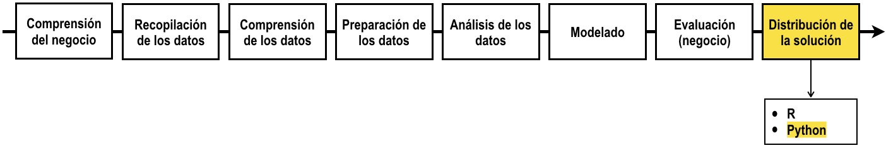

# Programación en Python para la creación de productos de datos

Haga click [aquí](http://nbviewer.jupyter.org/github/jdvelasq/Python-for-data-products/tree/master/)
para visualizar este repositorio en nbviewer.

## Descripción

La fase final de la Analítica comprende la creación de un producto de datos en el cual se plasmen
los resultados de los análisis y el conocimiento generado en las fases anteriores. A la fecha se 
reconocen los siguientes productos de datos:

* Documentos y reportes autocalculables.
* Dashboards.
* Productos de consumo y generación masiva de datos.

El siguiente grafo muestra donde encaja este tutorial en el proceso.

## Objetivos

Al finalizar este tutorial el lector debe estar en capacidad de:

* Generar archivos estáticos html a partir de código Python que contengan los resultados de las fases anteriores.
* Escribir aplicaciones simples usando Python y PyGt5.
* Generar dashboards usando Flask.

## Requerimientos

Para realizar este tutorial usted debe cumplir con uno de los siguientes
requisitos:

* Tener instalado Anaconda Python.
* Tener instalados los paquetes PyGt5, Flask y Jinja2.

---

**Juan David Velásquez Henao**    
jdvelasq@unal.edu.co  
Universidad Nacional de Colombia, Sede Medellín  
Facultad de Minas  
Medellín, Colombia  
[LinkedIn](https://co.linkedin.com/in/juan-david-velásquez-henao-94078979), [GitHub](https://github.com/jdvelasq), [ResearchGate](https://www.researchgate.net/profile/Juan_Velasquez8)

[Licencia](https://github.com/jdvelasq/Python-for-data-products/tree/master/LICENSE)

